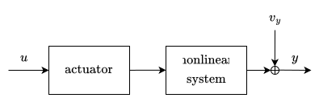
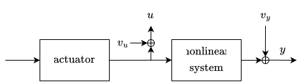
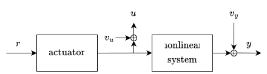
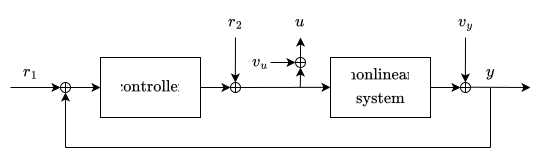

# best-linear-approximation

A well-tested Python package for estimating the nonparametric best linear approximation (BLA) and its uncertainty estimates for multivariable nonlinear systems in open- and closed-loop operation.

The implemented definitions follow *[System Identification: A Frequency Domain Approach, Second Edition][pintelon-schoukens]* by Rik Pintelon and Johan Schoukens, particularly the robust methods in Section 4.3.1.

## Basic usage

The four robust BLA methods correspond to different experimental conditions.
They estimate the equivalent nonlinear system from input $u$ to output $y$ under periodic multisine excitation.
The diagrams show the input-output signals and measurement-noise sources $v_u$ and $v_y$; see each method's docstring for its required arguments.

### Known input

Use this method when $u$ is known exactly.
The BLA then captures the apparent dynamics between $u$ and $y$, including delays, actuator dynamics, and nonlinear behavior.
This is useful in control applications, where including actuator dynamics in the model is often desirable.

<p align="center">
  
</p>

**Function:** `best_linear_approximation.robust.known_input(...)`

### Noisy input

When the aim is to identify the nonlinear system itself, measure the signal that enters it as $u$.
However, this makes $u$ a noise-corrupted measurement of the true input, which biases the BLA estimate.

<p align="center">
  
</p>

**Function:** `best_linear_approximation.robust.noisy_input(...)`

### Known reference

This has the same measured-input setup as the noisy-input case, but also uses a clean reference $r$.
Treating $r$ as an instrumental variable reduces the adverse effect of input measurement noise and enables the actuator-induced nonlinear distortion at the plant input to be quantified.

<p align="center">
  
</p>

**Function:** `best_linear_approximation.robust.known_reference(...)`

### Closed loop

Closed-loop estimation uses the same instrumental-variable principle.
The reference prevents the biased frequency-response estimate that would generally result from treating closed-loop data with an open-loop method.
The reference can be the output reference $r_1$, or an additive input reference $r_2$.
It must have the same number of channels as $u$, which is always guaranteed for $r_2$ but must be verified for $r_1$ in multivariable settings.

Note that an actuator is not shown in the below diagram.
It can be placed between $r_2$ and $u$, excluding its dynamics from the BLA, or between $u$ and the plant, including its dynamics in the BLA, depending on the desired model scope.

<p align="center">
  
</p>

**Function:** `best_linear_approximation.robust.closed_loop(...)`

## Result object

The estimation methods return a `NonparametricBLA` object:

```text
NonparametricBLA
├── G: FrequencyResponse
│   ├── value
│   └── noise, nonlinear, total: Uncertainty
├── spectra: Spectra
│   ├── U: InputSpectrum
│   │   ├── value
│   │   └── noise, nonlinear, total: Uncertainty
│   ├── Y: OutputSpectrum
│   │   ├── value
│   │   └── noise, nonlinear, total, total_equation_error: Uncertainty
│   └── R: InputSpectrum | None
|       └── value
├── freq: FrequencyInfo
└── experiment: ExperimentInfo
```

Each available uncertainty field is an `Uncertainty` object:

```text
Uncertainty
├── cov: ComplexArray | None              (n_bins, n_channels, n_channels), joint covariance
├── var: RealArray | None                 (n_bins, *marginal_shape), marginal variance
├── std: RealArray | None                 (n_bins, *marginal_shape), marginal standard deviation
├── as_percentage: RealArray | None       uncertainty RMS relative to "value" RMS, in %
└── as_power_ratio_db: RealArray | None   "value" RMS relative to uncertainty RMS, in dB
```

Here, `n_channels` is the product of `marginal_shape`, such as `ny * nu` for a frequency response with shape `(ny, nu)`.

Input-output spectra and their noise uncertainties are returned at every frequency bin; all other values and uncertainties are returned only at excited frequency bins.
When an uncertainty cannot be estimated from the available measurements, its properties are `None`.

`as_percentage` and `as_power_ratio_db` reduce the frequency axis, yielding useful component-wise summary statistics.
For example, for each output channel, `bla_estimate.spectra.Y.noise.as_power_ratio_db` gives the signal-to-noise ratio, while `bla_estimate.spectra.Y.noise.as_percentage` gives an a priori, noise-imposed lower bound on the achievable simulation error of a nonlinear parametric model identified from the data.

## Benchmark datasets

For convenient access to selected benchmark datasets from [nonlinearbenchmark.org](https://www.nonlinearbenchmark.org/), the package provides `best_linear_approximation.dataloader`, which loads and prepares multisine data in the format required by the BLA estimators.

The following benchmarks are included:

- F-16 aircraft; `load_f16()`
- Fine Steering Mirror; `load_fine_steering_mirror()`
- Parallel Wiener-Hammerstein; `load_parallel_wiener_hammerstein()`
- Silverbox; `load_silverbox()`

## Example

```python
import best_linear_approximation as bla

data = bla.dataloader.load_fine_steering_mirror()["train 300mV"]

bla_estimate = bla.robust.noisy_input(data.u, data.y, data.fs)
```

The above call automatically detects the excited frequency bins from `data.u`.
Alternatively, if the bins are known, they can be passed as the fourth argument to `noisy_input(...)`.

Additional examples and visualizations of nonlinear benchmark systems are available in [`examples/`](examples/).

## Installation

Requires Python 3.12 or later.
The only runtime dependency is NumPy (2.0 or later).

Install with `pip`:

```bash
pip install best-linear-approximation
```

Or add it to a `uv` project:

```bash
uv add best-linear-approximation
```

If you wish to use the benchmark dataloader, replace `best-linear-approximation` in either command with `"best-linear-approximation[benchmarks]"`.
This installs the additional required dependencies.
Calling a benchmark loader may download its data to the local cache when it is not already available.

## Related packages

Looking for:

- multisine excitation signals? See [multisine](https://github.com/merijnfloren/multisine).
- parametric state-space models, linear or nonlinear? See [freq-statespace](https://github.com/merijnfloren/freq-statespace).

[pintelon-schoukens]: https://doi.org/10.1002/9781118287422
